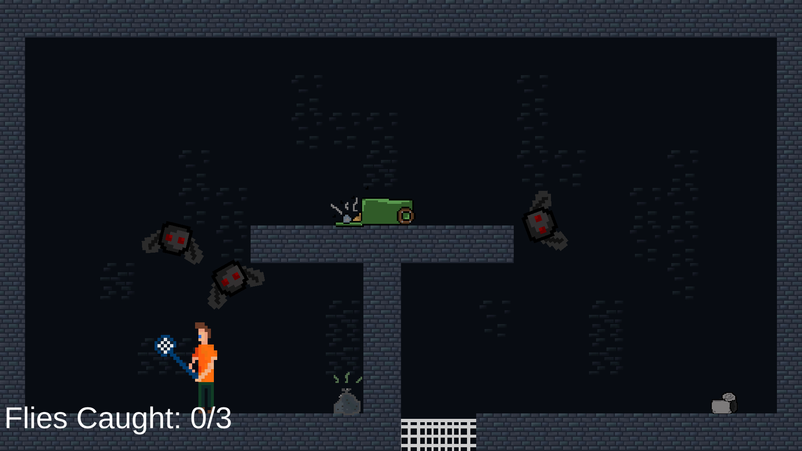
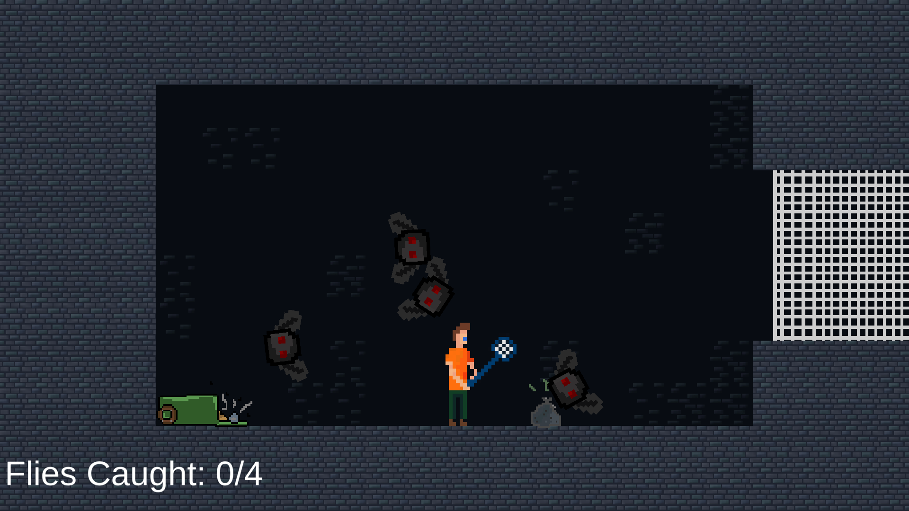
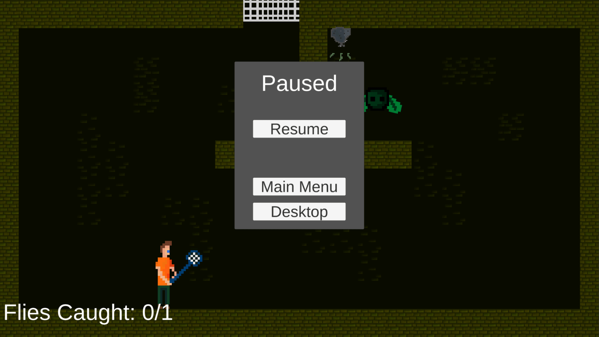
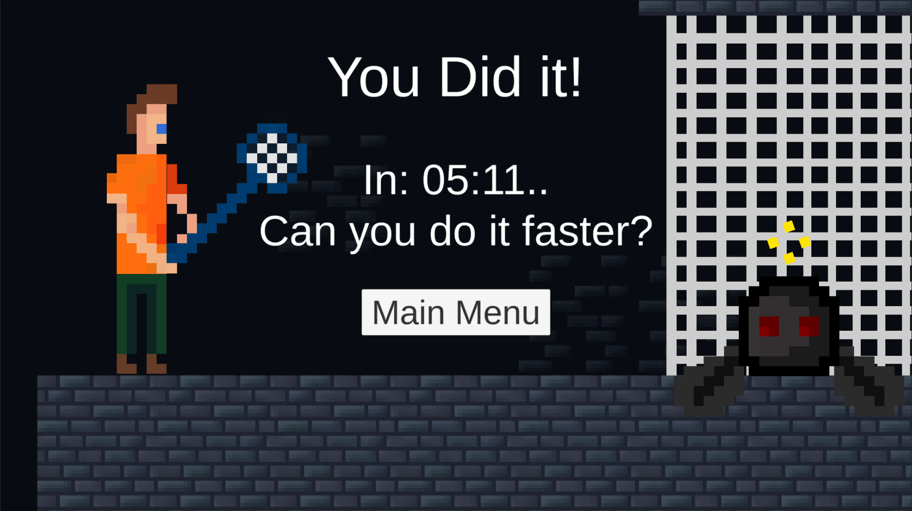

[IF YOU DON'T WANT SPOILERS GO PLAY FLY SWATTER BEFORE YOU READ.](https://kimcodekill.itch.io/fly-swatter)

Probably the most fun I've had making games is during the game jams my university hosts twice a year. In fall 2020 it had the theme "Intentional Bugs" and I immediately got ideas. I started by thinking about how the theme could be interpreted and the two most obvious ones were "It's not a bug, it's a feature" and "Insects with plans". I decided to combine these two interpretations and create a game where the player could exploit a broken "PlayerController" script and get to places which seemed impossible otherwise. You can see this in the gif below.

The platform in the middle of the level is impossible to reach using jumping and walking. The player uses "wall jumping" to reach the roof of the level, followed by "attack gliding" to get to the platform. This intends to teach the player that using these exploits is completely necessary to complete the levels. It might not be clear enough since my teacher ended up spending about 2 minutes on this level. If I had time to keep working on the game I would add indicators in the environment that are easier to understand. 

Now, you might be asking "whats the point? whats the goal?", and it's very simple.

The player works for pest control and uses their handy fly swatter to swat all the flies into the net. In the gif above you can see the first level which teaches the player basic movement and what the goal is without testing their skill (it's assumed they have none yet). This level is intended to have little to no challenge and is meant to be more of a sandbox than a puzzle. This level also shows how the flies move in open areas and how they interact with the player and the walls.

The complexity comes later in the form of different levels and special flies. The gif above shows a level where the player controls normally, but the camera rotates. It turned out to be one of the trickier levels even though the layout is so simple and there only being one fly to catch. It really fooled people's perception and became challenging even though the inputs required to reach the goal hadn't changed.

The level pictured above introduces inverted flies which fall upwards after being hit rather than falling downwards. In fact, the level itself is just a flipped version of the second level which im hoping some people caught. The easiest way to finish this level is to either wait for the fly to move to the lower area on its own, or surf the fly down to the lower area. Hitting the fly will only cause it to get stuck in the top right corner.

There is more to say about the specific choices for level design, but in general i followed one specific rule: is it fun? By always asking myself if the feature or obstacle i added was fun, it was quick and easy to modify them. In the final level i really wanted to play around more with the inverted fly since it had been underused. I decided to make it a tower with hooked platforms so the player would have to play a sort of vertical minigolf to succeed. It really tested the skill and patience of the player and felt really rewarding when it was over. This is what I wanted. The earlier levels challenged the player to get better and better at exploiting the movement system. The levels also (hopefully) taught them all they needed to know about the puzzle of "how do i get the flies into the goal?". 

I'm really satisfied with this little game and it was a lot of fun to make. Especially since I got to work with my partner on the graphics. I'm used to game design, level design and programming mechanics, but it was nice to get out of that box for a bit. Apart from the music tracks, it was completely hand made by me (game design, level design, programming) and my partner (art, level design, quality assurance).

If there is anything more you would like me to talk about, please send me an email and I'll add an addendum to this post.